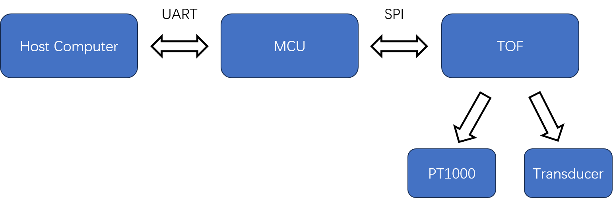

# Python API for Ultrasonic TOF
This is the python api for operating TOF measurement


## 连接设备
```python
pip install pyserial  # 安装串口模块
import serial         # 导入 pyserial 库
```
### 1. 获取从下拉列表中选择的串口名称
```python
selected_port = "COM3"  # 示例值，实际应从ports = serial.tools.list_ports.comports()中选取
```
### 2. 创建串口对象，设置波特率为 4800
```python
instrument_object = serial.Serial(
    port=selected_port,     # 串口名称
    baudrate=4800,          # 波特率
    timeout=1               # 可选的读取超时设置（单位：秒）
)
```
### 3. 配置输入缓冲区大小（单位：字节）
```python
instrument_object.input_buffer_size = 5000000  # 设置缓冲区为 5,000,000 字节
```
打开串口（在 pyserial 中，创建对象时若未设置 open()，则需显式打开）
 注意：如果在创建 Serial 对象时未指定 lazy_open=True，串口会在创建时自动打开。
```python
if not instrument_object.is_open:
    instrument_object.open()
```

 此时串口已打开，可以开始读写操作
```python
print(f"串口 {selected_port} 已成功打开，波特率 4800，输入缓冲区大小 {instrument_object.input_buffer_size} 字节")
```

## 配置设备

### 寄存器
```python
# reg0
sel_tsto1 = 0;
sel_tsto2 = 0;
       
sel_timo_mb=2;
hitin=9;
      
neg_stop=0;
neg_start=0; 
# 1 晶振持续开启， 2tdc启动之后，开启晶振
start_clkhs=1;
div_clkhs=0;
div_fire=3;
anz_fire=8;
       
# register1
offset=0;
DELVAL1=120;
RFEDGE=0;
EN_INT_ALU=1;
EN_INT_HIT=0;
EN_INT_TO=0;
```

### 核心寄存器，
anz_fire发射脉冲的数量，范围0到127，0表示不发射

hitin, 预期接收到的脉冲数量，范围0~127，比如9，表示期待接收到（9-1）个脉冲，如果实际接收到的数量比期待少，会直接触发错误，返回最大的飞行时间。

sel_timo_mb，测量范围溢出选择时间限制
```
0=64μs 1=128μs
2=256μs 3=512μs
4=1024μs5=2048μs
6=4096μs
```

DELVAL1， 回波检测器打开的时间窗口，发射脉冲后，等待一个固定时间，打开回波检测，单位时间是250 ns的倍数，16位整数部分，5位小数部分, 如果不管小数部分可以，直接用微秒单位的时间除以250ns然后取整就行

offset, 回波检测器的触发阈值，
```
0=0mv
1=2mv
…
31=62mV
32=-64mv
…
63=-2mv
```

### 寄存器打包函数
```python
def build_write_reg0_param(sel_tsto1, sel_tsto2, sel_timo_mb, hitin,
                           neg_stop, neg_start, start_clkhs, div_clkhs,
                           div_fire, anz_fire):
    """
    带参数的寄存器构建函数
    
    输入参数:
        sel_tsto1   - bit 0 (1位)
        sel_tsto2   - bits 2-1 (2位)
        sel_timo_mb - bits 5-3 (3位)  
        hitin       - bits 11-8 (4位)
        neg_stop    - bit 12 (1位)
        neg_start   - bit 13 (1位)
        start_clkhs - bits 15-14 (2位)
        div_clkhs   - bits 17-16 (2位)
        div_fire    - bits 23-18 (6位)
        anz_fire    - bits 29-24 (6位)
    
    输出:
        reg - 32位无符号整数寄存器值
    """
    
    # 输入验证和类型转换（确保在有效范围内）
    sel_tsto1 = int(sel_tsto1) & 0x1          # 1位，掩码 0x1
    sel_tsto2 = int(sel_tsto2) & 0x3          # 2位，掩码 0x3
    sel_timo_mb = int(sel_timo_mb) & 0x7      # 3位，掩码 0x7
    hitin = int(hitin) & 0xF                  # 4位，掩码 0xF
    neg_stop = int(neg_stop) & 0x1            # 1位，掩码 0x1
    neg_start = int(neg_start) & 0x1          # 1位，掩码 0x1
    start_clkhs = int(start_clkhs) & 0x3      # 2位，掩码 0x3
    div_clkhs = int(div_clkhs) & 0x3          # 2位，掩码 0x3
    div_fire = int(div_fire) & 0x3F           # 6位，掩码 0x3F
    anz_fire = int(anz_fire) & 0x3F           # 6位，掩码 0x3F
    
    reg = 0
    
    # 构建寄存器值
    reg |= sel_tsto1                                   # bit 0
    reg |= sel_tsto2 << 1                              # bits 2-1（注意：原MATLAB代码位移2，但实际bits 2-1意味着最低位在bit1，所以位移1）
    reg |= sel_timo_mb << 3                            # bits 5-3（位移3）
    reg |= hitin << 8                                  # bits 11-8（位移8）
    reg |= neg_stop << 12                              # bit 12（位移12）
    reg |= neg_start << 13                             # bit 13（位移13）
    reg |= start_clkhs << 14                           # bits 15-14（位移14）
    reg |= div_clkhs << 16                             # bits 17-16（位移16）
    reg |= div_fire << 18                              # bits 23-18（位移18）
    reg |= anz_fire << 24                              # bits 29-24（位移24）
    
    # 确保返回值为32位无符号整数
    return reg & 0xFFFFFFFF
```

打包第二个寄存器
```python
def build_write_reg1_param(offset, DELVAL1, RFEDGE, EN_INT_ALU, EN_INT_HIT, EN_INT_TO):
    """
    带参数的寄存器1构建函数
    
    输入参数:
        offset      - bits 11:0 (12位)
        DELVAL1     - bits 27:12 (16位)
        RFEDGE      - bit 28
        EN_INT_ALU  - bit 29
        EN_INT_HIT  - bit 30  
        EN_INT_TO   - bit 31
    
    输出:
        reg - 32位无符号整数寄存器值
    """
    
    # 输入验证和类型转换（确保在有效范围内）
    offset = int(offset) & 0xFFF           # 12位，掩码 0xFFF (4095)
    DELVAL1 = int(DELVAL1) & 0xFFFF        # 16位，掩码 0xFFFF (65535)
    RFEDGE = int(RFEDGE) & 0x1             # 1位，掩码 0x1
    EN_INT_ALU = int(EN_INT_ALU) & 0x1     # 1位，掩码 0x1
    EN_INT_HIT = int(EN_INT_HIT) & 0x1     # 1位，掩码 0x1
    EN_INT_TO = int(EN_INT_TO) & 0x1       # 1位，掩码 0x1
    
    reg = 0
    
    # 构建寄存器值
    reg |= offset                           # bits 11:0 (位移 0)
    reg |= DELVAL1 << 12                    # bits 27:12 (位移 12)
    reg |= RFEDGE << 28                     # bit 28 (位移 28)
    reg |= EN_INT_ALU << 29                 # bit 29 (位移 29)
    reg |= EN_INT_HIT << 30                 # bit 30 (位移 30)
    reg |= EN_INT_TO << 31                  # bit 31 (位移 31)
    
    # 确保返回值为32位无符号整数
    return reg & 0xFFFFFFFF
```

### 将寄存器写入

```python

def trigger_and_write_registers(serial_port, reg0, reg1):
    """
    触发上传并写入两个寄存器到 MCU
    
    参数:
        serial_port: 已打开的 pyserial 串口对象
        reg0: 第一个寄存器的32位无符号整数值
        reg1: 第二个寄存器的32位无符号整数值
    """
    
    # 触发上传（发送1个字节的触发命令）
    serial_port.write(b'\x01')  # 发送 uint8 值 1
    
    # 写入寄存器0（32位无符号整数）
    # 注意：需要根据 MCU 的字节序来决定打包方式
    # 默认使用小端序（Little Endian），这是大多数 MCU 的格式
    reg0_bytes = reg0.to_bytes(4, byteorder='little', signed=False)
    serial_port.write(reg0_bytes)
    
    # 写入寄存器1（32位无符号整数）
    reg1_bytes = reg1.to_bytes(4, byteorder='little', signed=False)
    serial_port.write(reg1_bytes)
```

## 测量

### 校正温度

```python
import serial
import time
import numpy as np
from typing import List, Optional

def pt1000_to_temperature(resistance: float, R0_calibration: float = 1000.0) -> float:
    """
    将PT1000电阻值转换为温度值
    
    参数:
        resistance: PT1000测量得到的电阻值(Ω)
        R0_calibration: 校准参数(冰点电阻), 默认值 = 1000.0
    
    返回:
        temperature: 计算得到的温度值(°C)
    
    示例:
        temp = pt1000_to_temperature(1085.0, 1000.0)  # 使用标准校准
        temp = pt1000_to_temperature(1085.0, 1000.2)  # 使用实测冰点电阻校准
    """
    
    # 参数验证
    if resistance <= 0:
        raise ValueError(f"电阻值必须为正数，当前值: {resistance}")
    
    # IEC 60751 标准系数
    A = 3.9083e-3
    B = -5.775e-7
    
    # 使用校准后的R0进行计算
    R0 = R0_calibration
    
    # 解二次方程: R = R0 * (1 + A*t + B*t^2)
    # 重排为: B*t^2 + A*t + (1 - R/R0) = 0
    a = B
    b = A
    c = 1 - resistance / R0
    
    # 计算判别式
    discriminant = b**2 - 4*a*c
    
    if discriminant < 0:
        raise ValueError(f"无实数解，请检查电阻值范围: {resistance}Ω")
    
    # 计算两个可能的解
    t1 = (-b + np.sqrt(discriminant)) / (2*a)
    t2 = (-b - np.sqrt(discriminant)) / (2*a)
    
    # 选择物理意义正确的解 (在-200°C ~ 850°C范围内)
    if -200 <= t1 <= 850:
        return t1
    elif -200 <= t2 <= 850:
        return t2
    else:
        raise ValueError(f"计算得到的温度超出合理范围: t1={t1:.2f}°C, t2={t2:.2f}°C")

def read_tof_and_calculate_temperature(serial_port: serial.Serial, 
                                       R0_calibration: float = 1000.0,
                                       timeout_seconds: int = 30) -> Optional[np.ndarray]:
    """
    发送触发校准命令，读取TOF数据并计算温度
    
    参数:
        serial_port: 已打开的 pyserial 串口对象
        R0_calibration: PT1000校准参数
        timeout_seconds: 等待数据的超时时间（秒）
    
    返回:
        temperature: 计算得到的温度数组，失败时返回None
    """
    
    try:
        # 1. 发送3个触发校准命令
        print("发送触发校准命令 (值: 3)")
        serial_port.write(b'\x03')  # 发送 uint8 值 3
        serial_port.flush()
        print("触发命令已发送")
        
        # 2. 等待足够的TOF数据（至少800字节）
        print(f"等待TOF数据，当前缓冲区: {serial_port.in_waiting} 字节")
        wait_time = 0
        while serial_port.in_waiting < 800:
            time.sleep(1)
            wait_time += 1
            print(f"等待中... {wait_time}秒, 已接收: {serial_port.in_waiting} 字节")
            if wait_time > timeout_seconds:
                raise TimeoutError(f"等待TOF数据超时 ({timeout_seconds}秒)")
        
        print(f"数据已就绪，缓冲区大小: {serial_port.in_waiting} 字节")
        
        # 3. 读取电阻数据（200个float值）
        # 每个float占4字节，总共需要读取 200 * 4 = 800 字节
        raw_data_bytes = serial_port.read(800)  # 读取800字节
        
        if len(raw_data_bytes) < 800:
            print(f"警告: 只读取到 {len(raw_data_bytes)} 字节，期望800字节")
        
        # 将字节数据转换为float数组（假设小端序）
        raw_data = np.frombuffer(raw_data_bytes, dtype=np.float32)
        
        # 确保至少有200个数据点
        if len(raw_data) < 200:
            print(f"警告: 只获取到 {len(raw_data)} 个float值，期望200个")
        else:
            raw_data = raw_data[:200]  # 只取前200个
        
        print(f"成功读取 {len(raw_data)} 个电阻值")
        
        # 4. 计算温度
        temperatures = np.zeros(len(raw_data))
        for i, resistance in enumerate(raw_data):
            try:
                temperatures[i] = pt1000_to_temperature(resistance, R0_calibration)
            except ValueError as e:
                print(f"警告: 第{i+1}个电阻值 {resistance:.2f}Ω 转换失败: {e}")
                temperatures[i] = np.nan  # 使用NaN标记无效值
        
        # 统计有效数据
        valid_count = np.sum(~np.isnan(temperatures))
        print(f"温度计算完成: {valid_count}/{len(temperatures)} 个有效值")
        
        return temperatures
        
    except serial.SerialException as e:
        print(f"串口通信错误: {e}")
        return None
    except TimeoutError as e:
        print(f"超时错误: {e}")
        return None
    except Exception as e:
        print(f"未知错误: {e}")
        return None
```

### 单点精确测量超声飞行时间和温度

```python

import serial
import time
import numpy as np
from typing import Optional, Tuple


def read_tof_and_temperature(serial_port: serial.Serial, 
                            R0_calibration: float = 1000.0,
                            timeout_seconds: int = 30) -> Optional[Tuple[np.ndarray, float]]:
    """
    触发TOF测量并读取TOF数据和温度数据
    
    参数:
        serial_port: 已打开的 pyserial 串口对象
        R0_calibration: PT1000校准参数
        timeout_seconds: 等待数据的超时时间（秒）
    
    返回:
        (tof_data, temperature): TOF数据数组和温度值的元组，失败时返回None
        tof_data: 经过转换的TOF距离数据（单位取决于转换因子250的含义）
        temperature: 温度值(°C)
    """
    
    try:
        # 1. 发送触发TOF测量命令（值=2）
        print("发送TOF测量触发命令 (值: 2)")
        serial_port.write(b'\x02')  # 发送 uint8 值 2
        serial_port.flush()
        print("触发命令已发送")
        
        # 2. 等待TOF数据（至少8000字节，对应2000个uint32）
        print(f"等待TOF数据，当前缓冲区: {serial_port.in_waiting} 字节")
        wait_time = 0
        required_tof_bytes = 8000  # 2000个uint32 * 4字节 = 8000字节
        
        while serial_port.in_waiting < required_tof_bytes:
            time.sleep(1)
            wait_time += 1
            print(f"等待TOF数据中... {wait_time}秒, 已接收: {serial_port.in_waiting}/{required_tof_bytes} 字节")
            if wait_time > timeout_seconds:
                raise TimeoutError(f"等待TOF数据超时 ({timeout_seconds}秒)")
        
        print(f"TOF数据已就绪，缓冲区大小: {serial_port.in_waiting} 字节")
        
        # 3. 读取TOF数据（2000个uint32值）
        tof_bytes = serial_port.read(required_tof_bytes)
        
        if len(tof_bytes) < required_tof_bytes:
            print(f"警告: 只读取到 {len(tof_bytes)} 字节，期望 {required_tof_bytes} 字节")
            # 调整实际读取的uint32数量
            actual_uint32_count = len(tof_bytes) // 4
            tof_bytes = tof_bytes[:actual_uint32_count * 4]
        else:
            actual_uint32_count = 2000
        
        # 将字节数据转换为uint32数组（假设小端序）
        raw_tof_data = np.frombuffer(tof_bytes, dtype=np.uint32)
        
        # 应用转换公式: rawData / 2^16 * 250
        # 注意：MATLAB中2^16是65536
        tof_data = raw_tof_data / 65536.0 * 250.0
        
        print(f"成功读取 {len(tof_data)} 个TOF数据点")
        
        # 4. 等待温度数据（至少4字节，对应1个float）
        print(f"\n等待温度数据，当前缓冲区: {serial_port.in_waiting} 字节")
        wait_time = 0
        required_temp_bytes = 4
        
        while serial_port.in_waiting < required_temp_bytes:
            time.sleep(1)
            wait_time += 1
            print(f"等待温度数据中... {wait_time}秒, 已接收: {serial_port.in_waiting}/{required_temp_bytes} 字节")
            if wait_time > timeout_seconds:
                raise TimeoutError(f"等待温度数据超时 ({timeout_seconds}秒)")
        
        print(f"温度数据已就绪，缓冲区大小: {serial_port.in_waiting} 字节")
        
        # 5. 读取温度数据（1个float值）
        temp_bytes = serial_port.read(4)
        
        if len(temp_bytes) < 4:
            raise ValueError(f"温度数据读取不足: 只读到 {len(temp_bytes)} 字节")
        
        # 将字节数据转换为float（假设小端序）
        resistance = np.frombuffer(temp_bytes, dtype=np.float32)[0]
        
        print(f"读取电阻值: {resistance:.2f} Ω")
        
        # 6. 计算温度
        temperature = pt1000_to_temperature(resistance, R0_calibration)
        
        print(f"计算得到温度: {temperature:.2f} °C")
        
        return tof_data, temperature
        
    except serial.SerialException as e:
        print(f"串口通信错误: {e}")
        return None
    except TimeoutError as e:
        print(f"超时错误: {e}")
        return None
    except Exception as e:
        print(f"未知错误: {e}")
        return None

```


### 快速测量

```python
import serial
import time
import numpy as np
from typing import Optional, Tuple

def trigger_short_tof_measurement(serial_port: serial.Serial, 
                                  R0_calibration: float = 1000.0,
                                  timeout_seconds: int = 30) -> Optional[Tuple[float, float]]:
    """
    触发短距离TOF快速测量并读取TOF数据和温度数据
    
    参数:
        serial_port: 已打开的 pyserial 串口对象
        R0_calibration: PT1000校准参数
        timeout_seconds: 等待数据的超时时间（秒）
    
    返回:
        (tof_distance, temperature): TOF距离值和温度值的元组，失败时返回None
        tof_distance: TOF测量的距离值（单位取决于转换因子250的含义）
        temperature: 温度值(°C)
    """
    
    try:
        # 1. 发送触发短距离TOF测量命令（值=6）
        print("发送短距离TOF测量触发命令 (值: 6)")
        serial_port.write(b'\x06')  # 发送 uint8 值 6
        serial_port.flush()
        print("触发命令已发送")
        
        # 2. 等待TOF数据（至少4字节，对应1个uint32）
        print(f"等待TOF数据，当前缓冲区: {serial_port.in_waiting} 字节")
        wait_time = 0
        
        while serial_port.in_waiting < 4:
            time.sleep(1)
            wait_time += 1
            print(f"等待TOF数据中... {wait_time}秒, 已接收: {serial_port.in_waiting}/4 字节")
            if wait_time > timeout_seconds:
                raise TimeoutError(f"等待TOF数据超时 ({timeout_seconds}秒)")
        
        print(f"TOF数据已就绪，缓冲区大小: {serial_port.in_waiting} 字节")
        
        # 3. 读取TOF数据（1个uint32值）
        tof_bytes = serial_port.read(4)
        
        if len(tof_bytes) < 4:
            raise ValueError(f"TOF数据读取不足: 只读到 {len(tof_bytes)} 字节")
        
        # 将字节数据转换为uint32（假设小端序）
        raw_tof_value = np.frombuffer(tof_bytes, dtype=np.uint32)[0]
        
        # 应用转换公式: rawData / 2^16 * 250
        # 注意：MATLAB中2^16是65536
        tof_distance = raw_tof_value / 65536.0 * 250.0
        
        print(f"原始TOF值: {raw_tof_value}")
        print(f"转换后TOF距离: {tof_distance:.2f}")
        
        # 4. 等待温度数据（至少4字节，对应1个float）
        print(f"\n等待温度数据，当前缓冲区: {serial_port.in_waiting} 字节")
        wait_time = 0
        
        while serial_port.in_waiting < 4:
            time.sleep(1)
            wait_time += 1
            print(f"等待温度数据中... {wait_time}秒, 已接收: {serial_port.in_waiting}/4 字节")
            if wait_time > timeout_seconds:
                raise TimeoutError(f"等待温度数据超时 ({timeout_seconds}秒)")
        
        print(f"温度数据已就绪，缓冲区大小: {serial_port.in_waiting} 字节")
        
        # 5. 读取温度数据（1个float值）
        temp_bytes = serial_port.read(4)
        
        if len(temp_bytes) < 4:
            raise ValueError(f"温度数据读取不足: 只读到 {len(temp_bytes)} 字节")
        
        # 将字节数据转换为float（假设小端序）
        resistance = np.frombuffer(temp_bytes, dtype=np.float32)[0]
        
        print(f"读取电阻值: {resistance:.2f} Ω")
        
        # 6. 计算温度（复用之前的pt1000_to_temperature函数）
        temperature = pt1000_to_temperature(resistance, R0_calibration)
        
        print(f"计算得到温度: {temperature:.2f} °C")
        
        return tof_distance, temperature
        
    except serial.SerialException as e:
        print(f"串口通信错误: {e}")
        return None
    except TimeoutError as e:
        print(f"超时错误: {e}")
        return None
    except Exception as e:
        print(f"未知错误: {e}")
        return None


```

## 重启MCU
```python
import serial
import time

def send_reset_signal(serial_port: serial.Serial) -> bool:
    """
    发送复位信号重启MCU，防止进入未知状态
    
    参数:
        serial_port: 已打开的 pyserial 串口对象
    
    返回:
        bool: 是否成功发送复位信号
    """
    try:
        # 发送复位信号（uint8值 0）
        serial_port.write(b'\x00')  # 发送 uint8 值 0
        serial_port.flush()  # 确保数据发送完成
        
        print("复位信号已发送 (值: 0)")
        return True
        
    except serial.SerialException as e:
        print(f"发送复位信号失败: {e}")
        return False

```

## 完整的使用例程

```python
"""
超声波TOF设备完整操作例程
Author: Based on Ultrasonic-TOF Python API
Date: 2024
"""

import serial
import serial.tools.list_ports
import numpy as np
import time
import matplotlib.pyplot as plt
from typing import Optional, Tuple, List, Dict

# ==================== 第一部分：设备连接和管理 ====================

def list_available_ports() -> List[str]:
    """列出所有可用的串口"""
    ports = serial.tools.list_ports.comports()
    return [port.device for port in ports]

def select_port_from_list() -> Optional[str]:
    """交互式选择串口"""
    ports = list_available_ports()
    
    if not ports:
        print("错误：未检测到任何串口设备！")
        return None
    
    print("\n检测到以下串口：")
    for idx, port in enumerate(ports, 1):
        port_info = serial.tools.list_ports.comports()[idx-1]
        print(f"  {idx}. {port} - {port_info.description}")
    
    while True:
        try:
            choice = input(f"\n请选择串口（1-{len(ports)}，输入0退出）：")
            if choice == '0':
                return None
            selected_idx = int(choice) - 1
            if 0 <= selected_idx < len(ports):
                return ports[selected_idx]
            else:
                print(f"请输入 1-{len(ports)} 之间的数字")
        except ValueError:
            print("输入无效，请输入数字")

def connect_device(port: str, baudrate: int = 4800) -> Optional[serial.Serial]:
    """连接TOF设备"""
    try:
        instrument = serial.Serial(
            port=port,
            baudrate=baudrate,
            timeout=1,
            write_timeout=1
        )
        instrument.input_buffer_size = 5000000  # 设置缓冲区大小
        
        if not instrument.is_open:
            instrument.open()
        
        print(f"\n✓ 成功连接设备：{port}")
        print(f"  波特率：{baudrate}")
        print(f"  缓冲区大小：{instrument.input_buffer_size} 字节")
        
        return instrument
    except serial.SerialException as e:
        print(f"✗ 连接失败：{e}")
        return None

# ==================== 第二部分：寄存器配置 ====================

def build_write_reg0_param(sel_tsto1: int, sel_tsto2: int, sel_timo_mb: int, hitin: int,
                           neg_stop: int, neg_start: int, start_clkhs: int, div_clkhs: int,
                           div_fire: int, anz_fire: int) -> int:
    """
    构建寄存器0的值
    包含发射脉冲数量、接收脉冲数量、测量范围等配置
    """
    # 输入验证和类型转换
    sel_tsto1 = int(sel_tsto1) & 0x1
    sel_tsto2 = int(sel_tsto2) & 0x3
    sel_timo_mb = int(sel_timo_mb) & 0x7
    hitin = int(hitin) & 0xF
    neg_stop = int(neg_stop) & 0x1
    neg_start = int(neg_start) & 0x1
    start_clkhs = int(start_clkhs) & 0x3
    div_clkhs = int(div_clkhs) & 0x3
    div_fire = int(div_fire) & 0x3F
    anz_fire = int(anz_fire) & 0x3F
    
    reg = 0
    reg |= sel_tsto1
    reg |= sel_tsto2 << 1
    reg |= sel_timo_mb << 3
    reg |= hitin << 8
    reg |= neg_stop << 12
    reg |= neg_start << 13
    reg |= start_clkhs << 14
    reg |= div_clkhs << 16
    reg |= div_fire << 18
    reg |= anz_fire << 24
    
    return reg & 0xFFFFFFFF

def build_write_reg1_param(offset: int, DELVAL1: int, RFEDGE: int, 
                          EN_INT_ALU: int, EN_INT_HIT: int, EN_INT_TO: int) -> int:
    """
    构建寄存器1的值
    包含回波检测窗口、触发阈值、中断使能等配置
    """
    offset = int(offset) & 0xFFF
    DELVAL1 = int(DELVAL1) & 0xFFFF
    RFEDGE = int(RFEDGE) & 0x1
    EN_INT_ALU = int(EN_INT_ALU) & 0x1
    EN_INT_HIT = int(EN_INT_HIT) & 0x1
    EN_INT_TO = int(EN_INT_TO) & 0x1
    
    reg = 0
    reg |= offset
    reg |= DELVAL1 << 12
    reg |= RFEDGE << 28
    reg |= EN_INT_ALU << 29
    reg |= EN_INT_HIT << 30
    reg |= EN_INT_TO << 31
    
    return reg & 0xFFFFFFFF

def write_registers(serial_port: serial.Serial, reg0: int, reg1: int) -> bool:
    """将寄存器配置写入设备"""
    try:
        # 发送配置触发命令
        serial_port.write(b'\x01')
        serial_port.flush()
        
        # 写入寄存器0和1
        reg0_bytes = reg0.to_bytes(4, byteorder='little', signed=False)
        reg1_bytes = reg1.to_bytes(4, byteorder='little', signed=False)
        serial_port.write(reg0_bytes)
        serial_port.write(reg1_bytes)
        serial_port.flush()
        
        print("✓ 寄存器配置已写入")
        return True
    except Exception as e:
        print(f"✗ 写入寄存器失败：{e}")
        return False

# ==================== 第三部分：温度测量和转换 ====================

def pt1000_to_temperature(resistance: float, R0_calibration: float = 1000.0) -> float:
    """将PT1000电阻值转换为温度（IEC 60751标准）"""
    if resistance <= 0:
        raise ValueError(f"电阻值必须为正数：{resistance}")
    
    # IEC 60751 标准系数
    A = 3.9083e-3
    B = -5.775e-7
    
    R0 = R0_calibration
    a, b, c = B, A, 1 - resistance / R0
    
    discriminant = b**2 - 4*a*c
    if discriminant < 0:
        raise ValueError(f"电阻值超出范围：{resistance}Ω")
    
    t1 = (-b + np.sqrt(discriminant)) / (2*a)
    t2 = (-b - np.sqrt(discriminant)) / (2*a)
    
    if -200 <= t1 <= 850:
        return t1
    elif -200 <= t2 <= 850:
        return t2
    else:
        raise ValueError(f"温度超出范围：{resistance}Ω")

def calibrate_temperature(serial_port: serial.Serial, R0_calibration: float = 1000.0) -> Optional[np.ndarray]:
    """温度校准测量"""
    try:
        print("\n--- 开始温度校准 ---")
        serial_port.write(b'\x03')
        serial_port.flush()
        
        # 等待数据
        wait_time = 0
        while serial_port.in_waiting < 800:
            time.sleep(0.5)
            wait_time += 0.5
            if wait_time > 30:
                raise TimeoutError("温度校准超时")
        
        # 读取并计算温度
        data_bytes = serial_port.read(800)
        raw_data = np.frombuffer(data_bytes, dtype=np.float32)[:200]
        
        temperatures = []
        for resistance in raw_data:
            try:
                temp = pt1000_to_temperature(resistance, R0_calibration)
                temperatures.append(temp)
            except ValueError:
                temperatures.append(np.nan)
        
        temperatures = np.array(temperatures)
        valid_count = np.sum(~np.isnan(temperatures))
        print(f"温度校准完成：有效数据 {valid_count}/200")
        
        return temperatures
        
    except Exception as e:
        print(f"温度校准失败：{e}")
        return None

# ==================== 第四部分：TOF测量 ====================

def tof_raw_to_distance(raw_value: int) -> float:
    """将原始TOF值转换为距离"""
    return raw_value / 65536.0 * 250.0

def measure_tof_full(serial_port: serial.Serial, timeout_seconds: int = 30) -> Optional[Tuple[np.ndarray, float]]:
    """
    完整TOF测量（2000个点）
    返回：(距离数组, 温度值)
    """
    try:
        print("\n--- 开始完整TOF测量 ---")
        serial_port.write(b'\x02')
        serial_port.flush()
        
        # 等待TOF数据
        wait_time = 0
        while serial_port.in_waiting < 8000:
            time.sleep(0.5)
            wait_time += 0.5
            if wait_time > timeout_seconds:
                raise TimeoutError("TOF数据接收超时")
        
        # 读取TOF数据
        tof_bytes = serial_port.read(8000)
        raw_tof = np.frombuffer(tof_bytes, dtype=np.uint32)
        distances = np.array([tof_raw_to_distance(v) for v in raw_tof])
        
        # 等待温度数据
        while serial_port.in_waiting < 4:
            time.sleep(0.1)
        
        # 读取温度
        temp_bytes = serial_port.read(4)
        resistance = np.frombuffer(temp_bytes, dtype=np.float32)[0]
        temperature = pt1000_to_temperature(resistance)
        
        print(f"✓ 测量完成：{len(distances)}个TOF点，温度={temperature:.2f}°C")
        return distances, temperature
        
    except Exception as e:
        print(f"✗ 测量失败：{e}")
        return None

def measure_tof_quick(serial_port: serial.Serial, timeout_seconds: int = 30) -> Optional[Tuple[float, float]]:
    """
    快速TOF测量（单点）
    返回：(距离值, 温度值)
    """
    try:
        print("\n--- 开始快速TOF测量 ---")
        serial_port.write(b'\x06')
        serial_port.flush()
        
        # 等待TOF数据
        wait_time = 0
        while serial_port.in_waiting < 4:
            time.sleep(0.1)
            wait_time += 0.1
            if wait_time > timeout_seconds:
                raise TimeoutError("TOF数据接收超时")
        
        # 读取TOF数据
        tof_bytes = serial_port.read(4)
        raw_tof = np.frombuffer(tof_bytes, dtype=np.uint32)[0]
        distance = tof_raw_to_distance(raw_tof)
        
        # 等待温度数据
        while serial_port.in_waiting < 4:
            time.sleep(0.1)
        
        # 读取温度
        temp_bytes = serial_port.read(4)
        resistance = np.frombuffer(temp_bytes, dtype=np.float32)[0]
        temperature = pt1000_to_temperature(resistance)
        
        print(f"✓ 测量完成：距离={distance:.3f}，温度={temperature:.2f}°C")
        return distance, temperature
        
    except Exception as e:
        print(f"✗ 测量失败：{e}")
        return None

# ==================== 第五部分：设备复位 ====================

def reset_device(serial_port: serial.Serial) -> bool:
    """复位MCU设备"""
    try:
        print("\n--- 复位设备 ---")
        serial_port.reset_input_buffer()
        serial_port.reset_output_buffer()
        serial_port.write(b'\x00')
        serial_port.flush()
        
        time.sleep(1)  # 等待设备重启
        serial_port.reset_input_buffer()
        
        print("✓ 设备复位完成")
        return True
    except Exception as e:
        print(f"✗ 复位失败：{e}")
        return False

# ==================== 第六部分：数据分析和可视化 ====================

def analyze_tof_data(distances: np.ndarray, temperature: float):
    """分析TOF数据并打印统计信息"""
    valid_distances = distances[distances > 0]
    
    print("\n=== TOF数据分析 ===")
    print(f"测量点数：{len(distances)}")
    print(f"有效点数：{len(valid_distances)}")
    print(f"平均距离：{np.mean(valid_distances):.3f}")
    print(f"中位距离：{np.median(valid_distances):.3f}")
    print(f"标准差：{np.std(valid_distances):.4f}")
    print(f"最小距离：{np.min(valid_distances):.3f}")
    print(f"最大距离：{np.max(valid_distances):.3f}")
    print(f"环境温度：{temperature:.2f}°C")

def plot_tof_data(distances: np.ndarray, temperature: float):
    """绘制TOF数据图表"""
    try:
        plt.figure(figsize=(12, 5))
        
        # 距离曲线
        plt.subplot(1, 2, 1)
        plt.plot(distances, 'b-', linewidth=1)
        plt.axhline(y=np.mean(distances), color='r', linestyle='--', 
                   label=f'平均值：{np.mean(distances):.3f}')
        plt.xlabel('采样点')
        plt.ylabel('距离')
        plt.title(f'TOF测量曲线 (温度：{temperature:.2f}°C)')
        plt.grid(True, alpha=0.3)
        plt.legend()
        
        # 距离分布直方图
        plt.subplot(1, 2, 2)
        valid_distances = distances[distances > 0]
        plt.hist(valid_distances, bins=50, color='green', alpha=0.7, edgecolor='black')
        plt.xlabel('距离')
        plt.ylabel('频次')
        plt.title('TOF距离分布')
        plt.grid(True, alpha=0.3)
        
        plt.tight_layout()
        plt.show()
    except ImportError:
        print("matplotlib未安装，跳过图表显示")

# ==================== 第七部分：主程序例程 ====================

def main():
    """主程序：演示完整的设备操作流程"""
    
    print("=" * 60)
    print("超声波TOF设备操作例程")
    print("=" * 60)
    
    # 1. 连接设备
    port = select_port_from_list()
    if not port:
        print("未选择串口，程序退出")
        return
    
    ser = connect_device(port, baudrate=4800)
    if not ser:
        return
    
    try:
        # 2. 复位设备（确保设备处于已知状态）
        if not reset_device(ser):
            print("设备复位失败，继续尝试...")
        
        # 3. 配置寄存器参数
        print("\n--- 配置设备参数 ---")
        
        # 寄存器0配置（发射/接收参数）
        reg0 = build_write_reg0_param(
            sel_tsto1=0,      # 停止信号选择
            sel_tsto2=0,      # 启动信号选择
            sel_timo_mb=2,    # 测量范围：256μs
            hitin=9,          # 预期脉冲数：9-1=8个
            neg_stop=0,       # 停止信号极性
            neg_start=0,      # 启动信号极性
            start_clkhs=1,    # 晶振模式：TDC启动后开启
            div_clkhs=0,      # 时钟分频
            div_fire=3,       # 发射分频
            anz_fire=8        # 发射脉冲数：8个
        )
        
        # 寄存器1配置（回波检测参数）
        reg1 = build_write_reg1_param(
            offset=0,         # 触发阈值偏移
            DELVAL1=120,      # 回波检测窗口（120 * 250ns = 30μs）
            RFEDGE=0,         # 上升/下降沿选择
            EN_INT_ALU=1,     # ALU中断使能
            EN_INT_HIT=0,     # Hit中断使能
            EN_INT_TO=0       # 超时中断使能
        )
        
        print(f"寄存器0值：0x{reg0:08X}")
        print(f"寄存器1值：0x{reg1:08X}")
        
        # 写入寄存器配置
        if not write_registers(ser, reg0, reg1):
            print("寄存器配置失败，程序退出")
            return
        
        # 4. 温度校准（可选）
        print("\n是否进行温度校准？(y/n)")
        if input().lower() == 'y':
            temperatures = calibrate_temperature(ser)
            if temperatures is not None:
                avg_temp = np.nanmean(temperatures)
                print(f"校准平均温度：{avg_temp:.2f}°C")
        
        # 5. 主测量循环
        while True:
            print("\n" + "=" * 60)
            print("请选择测量模式：")
            print("  1. 完整TOF测量（2000点）")
            print("  2. 快速TOF测量（单点）")
            print("  3. 连续快速测量")
            print("  4. 温度校准")
            print("  5. 设备复位")
            print("  0. 退出程序")
            
            choice = input("\n请输入选择：")
            
            if choice == '1':
                # 完整测量
                result = measure_tof_full(ser)
                if result:
                    distances, temperature = result
                    analyze_tof_data(distances, temperature)
                    
                    # 询问是否绘图
                    print("\n是否显示图表？(y/n)")
                    if input().lower() == 'y':
                        plot_tof_data(distances, temperature)
                
            elif choice == '2':
                # 快速测量
                result = measure_tof_quick(ser)
                if result:
                    distance, temperature = result
                    print(f"\n测量结果：距离={distance:.3f}，温度={temperature:.2f}°C")
                
            elif choice == '3':
                # 连续快速测量
                try:
                    print("\n开始连续测量（按Ctrl+C停止）...")
                    count = 0
                    while True:
                        result = measure_tof_quick(ser)
                        if result:
                            distance, temperature = result
                            count += 1
                            print(f"[{count:3d}] 距离={distance:7.3f}  温度={temperature:5.2f}°C")
                        time.sleep(0.2)
                except KeyboardInterrupt:
                    print(f"\n连续测量结束，共测量{count}次")
                
            elif choice == '4':
                # 温度校准
                temperatures = calibrate_temperature(ser)
                if temperatures is not None:
                    valid_temps = temperatures[~np.isnan(temperatures)]
                    if len(valid_temps) > 0:
                        print(f"\n温度校准结果：")
                        print(f"  平均温度：{np.mean(valid_temps):.2f}°C")
                        print(f"  标准差：{np.std(valid_temps):.3f}°C")
                        print(f"  温度范围：[{np.min(valid_temps):.2f}, {np.max(valid_temps):.2f}]°C")
                
            elif choice == '5':
                # 设备复位
                reset_device(ser)
                
            elif choice == '0':
                print("\n退出程序")
                break
            else:
                print("无效选择，请重新输入")
        
    except KeyboardInterrupt:
        print("\n\n用户中断程序")
    except Exception as e:
        print(f"\n程序异常：{e}")
    finally:
        # 6. 清理和断开连接
        print("\n--- 清理并断开连接 ---")
        reset_device(ser)  # 复位设备
        ser.close()
        print("设备已断开，程序结束")

# ==================== 简单使用例程（无需交互） ====================

def simple_measurement_example():
    """
    简单测量例程：直接执行一次完整测量
    适合脚本化使用
    """
    # 配置参数
    PORT_NAME = "COM3"  # 请修改为实际串口
    BAUD_RATE = 4800
    
    try:
        # 连接设备
        ser = serial.Serial(PORT_NAME, BAUD_RATE, timeout=1)
        ser.input_buffer_size = 5000000
        
        # 配置寄存器
        reg0 = build_write_reg0_param(0, 0, 2, 9, 0, 0, 1, 0, 3, 8)
        reg1 = build_write_reg1_param(0, 120, 0, 1, 0, 0)
        
        # 写入配置
        write_registers(ser, reg0, reg1)
        
        # 执行测量
        result = measure_tof_full(ser)
        
        if result:
            distances, temperature = result
            print(f"\n测量完成：")
            print(f"  平均距离：{np.mean(distances):.3f}")
            print(f"  温度：{temperature:.2f}°C")
        
        ser.close()
        
    except Exception as e:
        print(f"测量失败：{e}")

if __name__ == "__main__":
    # 运行完整交互式例程
    main()
    
    # 如需运行简单测量，取消下面的注释
    # simple_measurement_example()
```
